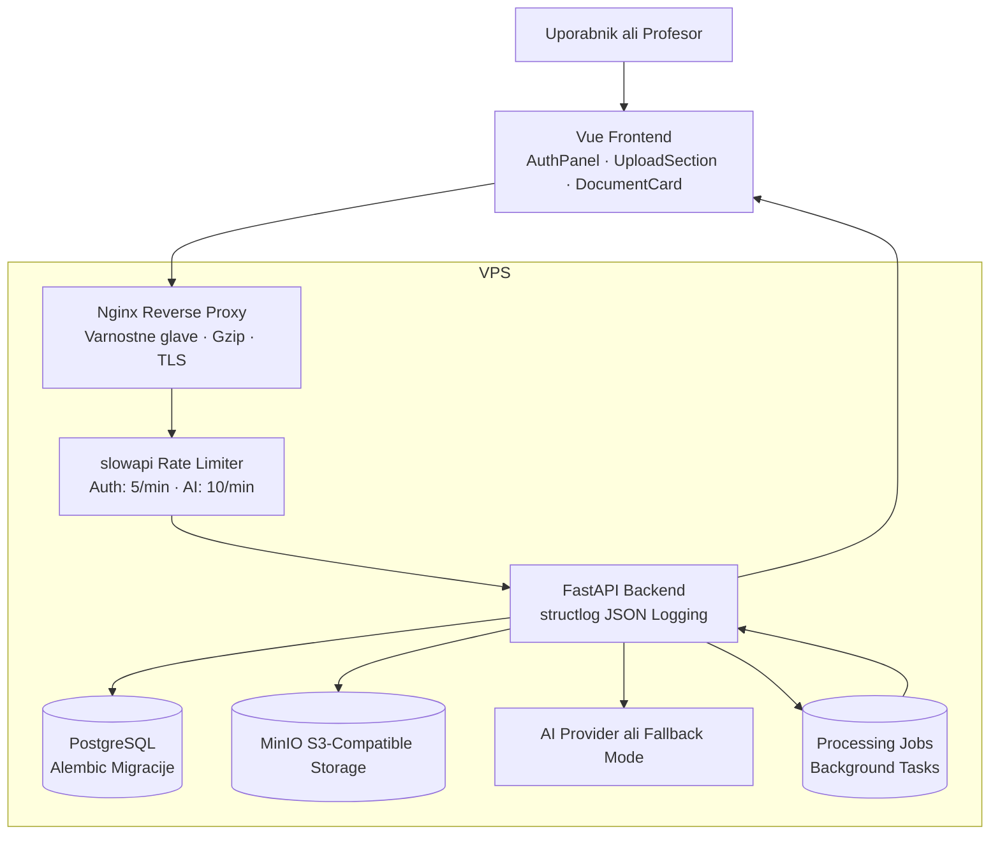
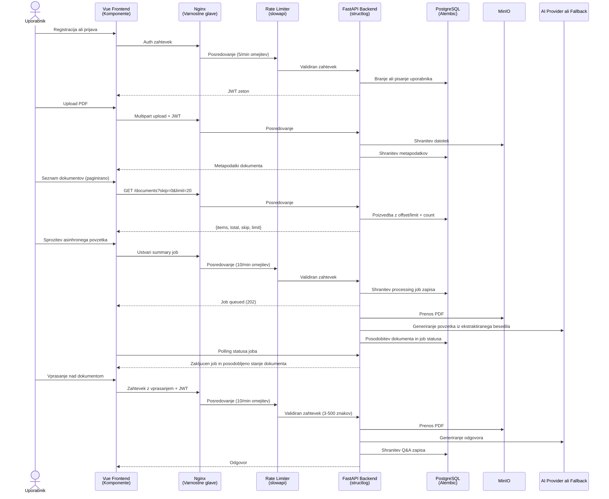

# Razvoj integrirane spletne storitve za varno upravljanje dokumentov z AI povzetki in dokumentnim Q&A v oblacni arhitekturi

## 1. Naslovnica

ALMA MATER EUROPAEA
Evropski center, Maribor

Program: Spletne in informacijske tehnologije

Predmet: Integracija spletnih strani in servisi

Studijsko leto: 2025/26

Nosilec predmeta: vis. pred. mag. Andrej Kositer

Vrsta naloge: MOZNOST 3 - Razvoj integrirane spletne storitve

Delovni naslov: Razvoj integrirane spletne storitve za varno upravljanje dokumentov z AI povzetki in dokumentnim Q&A v oblacni arhitekturi

Avtor: Michel

## 2. Povzetek in kljucne besede

### Povzetek

Naloga obravnava razvoj integrirane spletne storitve za varno upravljanje dokumentov v vecuporabniskem okolju. Resitev je zasnovana kot spletna aplikacija, ki uporabnikom omogoca registracijo, prijavo, nalaganje PDF dokumentov, samodejno generiranje povzetkov in postavljanje vprasanj nad vsebino posameznega dokumenta. Arhitektura sistema temelji na sodobnem oblacnem pristopu, kjer se uporabniski vmesnik izvaja kot spletna aplikacija Vue, poslovna logika kot FastAPI storitev, metapodatki se hranijo v relacijski bazi PostgreSQL, datoteke pa v objektni hrambi MinIO, ki je zdruzljiva z API-jem S3. Dodatna plast sistema omogoca integracijo z zunanjim AI ponudnikom ali uporabo lokalnega fallback nacina, kar zmanjsa strosek razvoja in omogoca demonstracijo tudi v omejenem okolju.

Poseben poudarek naloge je na integraciji storitev, varnosti in operativni izvedljivosti. Sistem uporablja JWT avtentikacijo, lastnistveno omejevanje dostopa do dokumentov, health in readiness endpointa, osnovno request logiranje ter produkcijsko usmerjen Docker Compose deployment na lastnem VPS strezniku. Za dolgotrajnejse operacije je implementiran tudi asinhroni obdelovalni model z obstojnimi job zapisi, kar izboljsa uporabnisko izkusnjo in realistično odraza sodobno arhitekturo storitev v oblaku.

Naloga dokazuje, da je mogoce z uporabo odprtokodnih tehnologij in omejenega proracuna razviti arhitekturno relevantno, varno in razsirljivo spletno storitev, ki odgovarja potrebam manjse slovenske organizacije. Poleg implementacije naloga vsebuje se varnostno presojo, stroškovno analizo, kriticno primerjavo z alternativo na upravljanih platformah in usmeritve za nadaljnji razvoj.

### Kljucne besede

oblak, FastAPI, Vue, PostgreSQL, MinIO, AI, JWT, Docker, VPS, OpenAPI

## 3. Abstract and Keywords

### Abstract

This project presents the development of an integrated web service for secure multi-user document management. The solution allows users to register, log in, upload PDF documents, generate AI-based summaries, and ask questions about the content of a selected document. The system follows a modern cloud-oriented architecture where the frontend is implemented in Vue, the backend in FastAPI, metadata is stored in PostgreSQL, and uploaded files are stored in MinIO, an S3-compatible object storage service. The AI layer supports both an external provider mode and a local fallback mode, which reduces mandatory costs and allows demonstration in constrained environments.

The project focuses strongly on service integration, security, and operational feasibility. The implementation includes JWT-based authentication, ownership-based access control, health and readiness endpoints, request logging, and a VPS-oriented Docker Compose deployment model. Long-running operations are handled through an asynchronous processing workflow with persistent job records, which makes the architecture more realistic and scalable.

The project demonstrates that an architecturally relevant and secure cloud-style service can be implemented using open technologies and a limited budget. In addition to implementation details, the report includes a security review, cost analysis, and a critical comparison with a managed-platform alternative.

### Keywords

cloud, FastAPI, Vue, PostgreSQL, MinIO, AI, JWT, Docker, VPS, OpenAPI

## 4. Uvod

Digitalni dokumenti so v skoraj vseh organizacijah osrednji nosilec informacij. Kljub temu so dokumenti pogosto shranjeni v razprsenih mapah, skupnih diskih ali ad hoc sistemih brez ustreznega nadzora dostopa, brez sledljivosti in brez moznosti hitrega povzemanja vsebine. To povzroca izgubo casa, tezjo uporabo dokumentov in vecje tveganje za varnostne napake.

Sodobni oblačni pristopi omogocajo integracijo spletnih storitev, objektne hrambe, relacijskih baz, avtentikacije in AI funkcionalnosti v enotno storitev, ki je dostopna vec uporabnikom in primerna tako za razvoj kot za produkcijsko uporabo. V okviru te naloge je bil izbran razvoj storitve, ki zdruzuje te elemente v konkretno resitev za manjsa podjetja ali interne organizacijske ekipe.

Cilj naloge je razviti spletno storitev, ki ne bo zgolj tehnicni prototip, temvec arhitekturno utemeljena integrirana resitev. To pomeni, da mora biti jasna delitev med komponentami, evidentni podatkovni tokovi, definirani varnostni mehanizmi, ocenjeni stroški in utemeljena izbira infrastrukture.

Pri delu je bila uporabljena iterativna metodologija. Najprej je bil definiran scenarij uporabe in arhitekturni okvir, nato je sledilo postopno uvajanje glavnih gradnikov: avtentikacije, persistentne podatkovne plasti, hrambe dokumentov, AI funkcionalnosti, asinhrone obdelave, uporabniskega vmesnika in produkcijske poti na VPS. Tak pristop je omogocil sprotno preverjanje konceptov in dosledno dokumentiranje po fazah.

Razvojni cikel je bil strukturiran v 18 faz, od katerih vsaka naslavlja dolocen vidik sistema. Dokumentacija za vsako fazo je vodena v loceni datoteki znotraj repozitorija (`docs/phase-01` do `docs/phase-18`), kar omogoca sledljivost odlocitev in kasnejso revizijo. Taksna fazna razdelitev je olajsala razvoj, saj je vsak korak prinsel merljiv rezultat, ki ga je bilo mogoce preveriti pred nadaljevanjem.

## 5. Problem in cilji

### 5.1 Problem

Osnovni problem, ki ga naslovlja naloga, je neučinkovito upravljanje dokumentov v organizacijskem okolju. Uporabniki pogosto potrebujejo hiter vpogled v vsebino internih dokumentov, vendar je iskanje kljucnih informacij zamudno. Obenem je pri uporabi zunanjih AI orodij pogosto prisoten problem zasebnosti, stroškov in pomanjkanja integracije z obstoječo infrastrukturo.

### 5.2 Cilji

Glavni cilji razvoja so:

1. izdelati večuporabniško spletno storitev z avtentikacijo in avtorizacijo,
2. implementirati REST API z OpenAPI dokumentacijo,
3. povezati aplikacijo z objektno hrambo za PDF dokumente,
4. dodati AI povzemanje in osnovni dokumentni Q&A,
5. pripraviti deployment model za lastni VPS,
6. dokumentirati varnostne, stroškovne in arhitekturne posledice izbrane zasnove.

## 6. Poslovni scenarij uporabe

Resitev je zasnovana za manjso slovensko organizacijo, ki upravlja interne pravilnike, navodila, porocila in tehnicno dokumentacijo. Uporabniki potrebujejo sistem, v katerega lahko nalozijo dokument, ga pozneje ponovno najdejo, pregledajo AI povzetek in nad njim zastavijo konkretno vprasanje.

Primer uporabe je podjetje, ki zaposlenim redno posreduje interne procedure. Namesto rocnega branja daljsih PDF dokumentov uporabnik dokument nalozi v sistem in pridobi povzetek. Ce potrebuje bolj usmerjeno informacijo, lahko postavi vprasanje, na primer kateri del pravilnika ureja obravnavo obcutljivih dokumentov. Sistem mu vrne odgovor na podlagi vsebine konkretnega dokumenta.

Tak scenarij je primeren za ocenjevanje, ker vkljucuje vecuporabnisko okolje, integracijo s hrambo, obdelavo vsebine dokumentov, varnostno omejevanje dostopa in jasno produkcijsko pot v oblaku.

## 7. Arhitekturni opis resitve

### 7.1 Logična arhitektura

Sistem je zasnovan kot modularni monolit z zunanjimi integracijami. Sestavljajo ga naslednje komponente:

1. Vue frontend za uporabniski vmesnik (razdeljen na komponente AuthPanel, UploadSection, DocumentCard),
2. FastAPI backend za REST API in poslovno logiko s strukturiranim JSON logiranjem (structlog),
3. PostgreSQL za hrambo metapodatkov in uporabniskih zapisov, z Alembic migracijami za nadzorovano evolucijo sheme,
4. MinIO za objektno hrambo PDF dokumentov, zdruzljiv z AWS S3 API,
5. AI storitvena plast, ki podpira zunanji API (OpenAI) in fallback nacin za lokalno demonstracijo,
6. asinhroni job mehanizem za summary in Q&A obdelavo z obstojnimi job zapisi,
7. slowapi rate limiter za zascito avtentikacijskih (5/min) in AI endpointov (10/min),
8. Nginx reverse proxy za produkcijsko izpostavitev storitve z varnostnimi glavami in gzip kompresijo.

Ta zasnova omogoca jasno ločitev odgovornosti in hkrati ohranja dovolj nizko kompleksnost za študentski projekt.

Arhitekturni diagram (Mermaid notacija):

Diagram prikazuje, da vsi zahtevki uporabnika prehajajo skozi reverse proxy, ki dodaja varnostne glave in posreduje zahtevke rate limiterju. Backend komunicira s PostgreSQL, MinIO in AI plastjo. Asinhroni jobe se izvajajo v ozadju in ob zakljucku posodobijo stanje v bazi.

### 7.2 Deployment arhitektura

Produkcijski deployment je predviden na lastnem VPS strezniku. Na njem tece Docker Compose sklad, ki vsebuje reverse proxy, frontend, backend, PostgreSQL in MinIO. Zunaj Docker mreze je javno izpostavljen le reverse proxy, medtem ko baza in objektna hramba ostaneta zasebni znotraj vsebnika oziroma internega omrezja.

Tak model ima dve pomembni prednosti. Prvic, omogoca nizje in bolj predvidljive stroške od vec samostojnih upravljanih storitev. Drugic, lokalno razvojno okolje ostane zelo podobno produkciji, kar zmanjsa tveganje za razlike med razvojem in dejanskim zagonom.

Docker okolje je razdeljeno na dva profila:

- **Razvojni profil** (`docker-compose.yml`): frontend tece v dev nacinu z Vite dev serverjem, backend je izpostavljen na portu 8000 za neposreden dostop, PostgreSQL in MinIO porti so dostopni za diagnostiko.
- **Produkcijski overlay** (`docker-compose.prod.yml`): frontend uporablja multi-stage Dockerfile (dev → build → nginx produkcija), backend port je skrit (dostopen le prek Nginx), storitve imajo definirane healthcheke in restart politike, PostgreSQL in MinIO porti niso izpostavljeni navzven.

Backend Dockerfile ustvari namenskega non-root uporabnika (`appuser`) in aplikacijo izvaja z omejenimi pravicami, kar je skladno s principom najmanjsih privilegijev (least privilege). Frontend Dockerfile v produkcijskem nacinu zgradi staticne datoteke in jih streže prek lahkega Nginx procesa.

Arhitekturni diagram je pripravljen tudi kot Mermaid artefakt v `docs/diagrams/architecture.mmd`.

### 7.3 Arhitekturne odločitve

Izbira FastAPI je bila motivirana z enostavno izdelavo REST API, samodejno OpenAPI dokumentacijo in dobro podporo za asinhrone operacije. Vue je primeren zaradi majhne kompleksnosti, hitrega razvoja in preglednega enostrankarskega uporabniskega toka — frontend je razdeljen na vec komponent (AuthPanel, UploadSection, DocumentCard), kar izboljsa preglednost in vzdrževljivost.

MinIO je bil izbran zato, ker omogoca lokalno in produkcijsko uporabo enakega S3-kompatibilnega pristopa, kar izboljsa prenosljivost arhitekture. Za podatkovno bazo je bil izbran PostgreSQL s SQLAlchemy ORM in Alembic migracijami, kar omogoca nadzorovano evolucijo sheme brez rocnega poseganja v bazo.

Backend vsebniki tecejo kot non-root uporabnik (appuser), kar zmanjsa posledice morebitne varnostne ranljivosti. Frontend uporablja multi-stage Docker build: razvojna faza poganja Vite dev server, produkcijska faza pa gradi staticne datoteke in jih streže prek lahkega Nginx procesa.

### 7.4 Podatkovni model

Relacijska baza vsebuje stiri glavne tabele:

- **users** — uporabniski racuni z email naslovom, bcrypt hash geslom in vlogo (user/admin)
- **documents** — metapodatki o nalozenih PDF dokumentih, vkljucno z lastnikom, kljucem v objektni hrambi, statusom obdelave in morebitnim povzetkom
- **processing_jobs** — zapisi asinhronih obdelovalnih nalog (summary, question), s statusom (queued, running, completed, failed), vhodom job_input in rezultatom
- **question_answers** — trajni zapisi vprasanj in odgovorov nad posameznim dokumentom, vkljucno z nacinom generiranja (provider ali fallback)

Shema je upravljana z Alembic migracijami. Zacetna migracija (`001_initial.py`) ustvari vse stiri tabele. Ob produkcijskem zagonu deploy skripta izvede `alembic upgrade head` pred zagonom aplikacije.

### 7.5 API zasnova

Backend izpostavlja 14 REST endpointov, razdeljenih v stiri logicne skupine:

| Skupina | Endpointi | Opis |
| --- | --- | --- |
| Zdravje | `GET /health`, `GET /ready` | Osnovni health check in preverjanje odvisnosti (DB, MinIO) |
| Avtentikacija | `POST /auth/register`, `POST /auth/login`, `GET /auth/me` | Registracija, prijava, profil trenutnega uporabnika |
| Dokumenti | `POST /documents/upload`, `GET /documents`, `GET /documents/{id}`, `POST /documents/{id}/summarize`, `POST /documents/{id}/summarize-jobs`, `POST /documents/{id}/ask`, `POST /documents/{id}/ask-jobs` | CRUD, povzemanje, Q&A (sinhrono in asinhrono) |
| Jobe | `GET /jobs/{id}` | Preverjanje statusa asinhrone obdelave |
| Status | `GET /api/v1/status` | Pregled konfiguracije in zmoznosti API |

Vsi endpointi imajo definirane `summary` in `description` parametre za OpenAPI dokumentacijo, ki je dostopna na `/docs` (Swagger UI) in `/redoc` (ReDoc).

## 8. Analiza integracije in podatkovnih tokov

### 8.1 Registracija in prijava

Uporabnik v uporabniskem vmesniku vnese podatke za registracijo ali prijavo. Backend ob registraciji ustvari uporabnika, zasciti geslo s hash funkcijo in ga shrani v relacijsko bazo. Ob prijavi backend preveri veljavnost poverilnic in izda JWT dostopni zeton. Frontend zeton shrani lokalno in ga posilja v glavi zahtevkov pri vseh zascitenih endpointih.

### 8.2 Upload dokumenta

Ko prijavljen uporabnik nalozi PDF, backend najprej preveri tip in velikost datoteke. Datoteka se nato shrani v MinIO bucket, v PostgreSQL pa se zapiše metapodatek: lastnik dokumenta, ime datoteke, ključ v objektni hrambi, velikost, tip in stanje obdelave. Ta tok dokazuje dejansko integracijo med spletno storitvijo, podatkovno bazo in objektno hrambo.

### 8.3 Povzemanje dokumenta

Za generiranje povzetka sistem uporablja dva nacina. Če je konfiguriran zunanji AI API, backend ekstraktirano besedilo posreduje modelu in shrani rezultat. Ce zunanja integracija ni na voljo, sistem uporabi lokalni fallback povzetek, kar omogoca delovanje tudi v nizkocenovnem ali demo okolju. V novejsi iteraciji povzetek tece asinhrono: frontend ustvari job, backend ga obdela v ozadju, rezultat pa je dostopen prek pollinga statusa.

### 8.4 Dokumentni Q&A

Uporabnik lahko na ravni posameznega dokumenta odda vprasanje. Backend iz MinIO pridobi datoteko, iz PDF-ja izlusci besedilo, nato pa ustvari odgovor z AI ali fallback mehanizmom. Vprasanje in odgovor se trajno shranita v bazo, kar omogoca sledljivost in kasnejso razsiritev v bolj bogat pogovorni vmesnik.

Podatkovni tokovi za prijavo, upload, asinhroni povzetek in dokumentni Q&A so zbrani v naslednjem diagramu:

Diagram prikazuje celoten zivljenjski cikel podatkov od registracije do dokumentnega Q&A. Vsak zahtevek prehaja skozi Nginx (varnostne glave), nato skozi rate limiter (za obcutljive endpointe), in koncno do backend logike, ki komunicira z bazo, objektno hrambo in AI storitvijo.

Podrobnejsa datoteka diagramov je dostopna v repozitoriju (`docs/diagrams/data-flow.mmd`).

## 9. Analiza varnosti

### 9.1 Identiteta in dostop

Sistem uporablja JWT avtentikacijo (algoritem HS256) z uporabo knjiznice python-jose. Uporabnik po uspesni prijavi prejme podpisan zeton, ki ga uporablja za dostop do zascitenih endpointov. Lastnistvo dokumentov je preverjeno na ravni backend logike, tako da uporabnik ne more dostopati do dokumentov drugega uporabnika samo z ugibanjem identifikatorja.

Ob zagonu v produkcijskem nacinu sistem preverja, da privzeti skrivni kljuc (`SECRET_KEY`) ni ostal na demo vrednosti, saj bi to pomenilo kriticno varnostno ranljivost.

### 9.2 Zascita gesel

Gesla se ne hranijo v cisti obliki, ampak zgolj kot bcrypt hash vrednosti (knjiznica passlib). Gesla morajo imeti najmanj 8 znakov in najvec 128 znakov. Email naslovi se validirajo s knjiznico email-validator. To je osnovni, vendar nujni varnostni ukrep za vse resne spletne storitve.

### 9.3 Zascita dokumentov

Dokumenti niso javno dostopni v objektni hrambi. Dostop do njih poteka skozi aplikacijsko logiko, kar omogoca centraliziran nadzor. V produkciji je dodatno pomembno, da MinIO ni neposredno izpostavljen javnemu omrezju.

### 9.4 Omejitev hitrosti zahtevkov (rate limiting)

Za zascito pred brute-force napadi in prekomerno uporabo je implementirano omejevanje hitrosti zahtevkov z uporabo knjiznice slowapi. Avtentikacijski endpointi (registracija in prijava) so omejeni na 5 zahtevkov na minuto na IP naslov. AI endpointi (povzemanje in Q&A) so omejeni na 10 zahtevkov na minuto. Ob prekoracitvi uporabnik prejme standardni HTTP odgovor 429 (Too Many Requests).

### 9.5 Varnostne glave in reverse proxy

Nginx reverse proxy v produkcijskem nacinu dodaja naslednje varnostne glave HTTP odgovorom:

- `X-Content-Type-Options: nosniff` — preprecitev MIME-type sniffinga
- `X-Frame-Options: DENY` — zascita pred clickjackingom
- `X-XSS-Protection: 1; mode=block` — dodatna XSS zascita v starejsih brskalnikih
- `Referrer-Policy: strict-origin-when-cross-origin` — nadzor nad referrer podatki
- `Content-Security-Policy` — omejevanje virov skript, stilov in povezav

Dodatno je aktivirana gzip kompresija za besedilne vsebine in omejitev velikosti nalaganja datotek (`client_max_body_size`).

### 9.6 Validacija vhodnih podatkov

Vsi vhodni podatki so validirani z uporabo Pydantic shem. Vprasanja pri dokumentnem Q&A morajo imeti najmanj 3 in najvec 500 znakov, kar prepreci zlorabo z izjemno dolgimi vnosi. Email format se validira na ravni sheme, imena datotek pa se sanitizirajo ob nalaganju.

### 9.7 Strukturirano logiranje

Backend uporablja knjiznico structlog za strukturirano JSON logiranje. Vsak HTTP zahtevek se belezi z metodo, potjo, statusno kodo in trajanjem v milisekundah. Globalni exception handler prepreci uhajanje notranjih podrobnosti napak (stack trace) v produkcijskem odgovoru — uporabnik prejme le genericno sporocilo, podrobnosti pa se zapisejo v dnevnik.

### 9.8 CORS in OWASP Top 10

CORS politika je omejene: dovoljene so le metode GET, POST in OPTIONS, le glave Authorization in Content-Type. V kontekstu OWASP Top 10 (2021) sistem naslavlja:

- **A01 Broken Access Control** — lastnistveno preverjanje za dokumente
- **A02 Cryptographic Failures** — bcrypt hash za gesla, HS256 za JWT
- **A03 Injection** — Pydantic validacija, SQLAlchemy ORM namesto surovega SQL
- **A04 Insecure Design** — modularna arhitektura z loceno podatkovno, storitveno in API plastjo
- **A05 Security Misconfiguration** — startup validacija skrivnega kljuca, varnostne glave
- **A07 Identification and Authentication Failures** — rate limiting na avtentikacijskih endpointih

### 9.9 Tveganja AI integracije

AI integracija prinaša več posebnih tveganj:

1. uhajanje obcutljivih podatkov do zunanjega ponudnika,
2. prompt injection zlonamerno oblikovanih dokumentov,
3. variabilni stroški ob večjem številu zahtevkov,
4. netocni ali halucinirani odgovori.

Za zmanjsanje tveganja je bila uvedena fallback moznost brez zunanje storitve, omejitev velikosti dokumentov in arhitekturna zamenljivost AI adapterja.

### 9.10 Znana omejitev: JWT v localStorage

JWT dostopni zeton se v frontendu hrani v localStorage. To predstavlja potencialno XSS ranljivost, saj JavaScript na strani brskalnika lahko dostopa do te vrednosti. Alternativa je uporaba httpOnly piskotka, ki pa zahteva dodatno kompleksnost pri CSRF zasciti in ne omogoca enostavne rabe z Bearer shemo. Za obseg te naloge je izbira dokumentirana in sprejemljiva; v produkcijskem sistemu bi bila potrebna nadgradnja.

### 9.11 Povzetek tveganj in ukrepov

| Tveganje | Posledica | Trenutni ukrep | Naslednji korak |
| --- | --- | --- | --- |
| Brute-force prijava | nepooblascen dostop | rate limiting (5/min na IP) | account lockout po N neuspesnih poskusih |
| Uhajanje podatkov do zunanjega AI ponudnika | pravna in poslovna tveganja | fallback nacin brez zunanjega AI API | anonimizacija ali strozji izbor dokumentov za AI obdelavo |
| Nedostopnost baze ali MinIO | nedelovanje storitve | readiness endpoint in healthchecki | opozorila in avtomatizirano spremljanje stanja |
| Napacna ali halucinirana AI vsebina | napacne odlocitve uporabnika | odgovor je vezan na konkreten dokument, ne na odprt klepet | prikaz opozorila in moznost revizije odgovora |
| Rast AI stroskov | nepredvidljiv operativni strosek | fallback nacin in modularen AI adapter | omejitve porabe, merjenje uporabe in izbira cenejsega modela |
| XSS napad na JWT | kraja uporabniskega zetona | sanitizacija vhodov, CSP glave | prehod na httpOnly piskotke |
| Preobremenitev aplikacijskega procesa | slabsa odzivnost pri vecjem prometu | asinhroni job zapis in polling | namenska worker komponenta |

## 10. Stroškovna analiza

### 10.1 Konkretna stroškovna tabela

| Postavka | Demo / izpitni zagon | Manjša organizacija | Opomba |
| --- | --- | --- | --- |
| VPS (Hetzner CX22, 2vCPU, 4GB RAM) | €4,51/mesec | €4,51/mesec | Vsi vsebniki na enem strezniku |
| Domena (.si) | ~€10/leto (~€0,83/mesec) | ~€10/leto | ARNES ali registrar |
| TLS certifikat (Let's Encrypt) | brezplacno | brezplacno | Avtomatizirano podaljsevanje |
| Objektna hramba (MinIO na VPS) | vkljuceno v VPS | vkljuceno v VPS | Do ~40 GB na diska CX22 |
| OpenAI API (gpt-3.5-turbo) | €0–2/mesec | €5–15/mesec | ~€0,002 na 1K tokenov; demo: <100 poizvedb |
| Upravljanje baze (PostgreSQL na VPS) | vkljuceno v VPS | vkljuceno v VPS | Docker container |
| **Skupaj mesecno** | **~€5–7** | **~€10–20** | |

### 10.2 Primerjava z upravljano alternativo (Managed PaaS)

| Postavka | VPS pristop | Managed PaaS (AWS/GCP ekvivalent) |
| --- | --- | --- |
| Compute | €4,51/mesec (Hetzner CX22) | €15–40/mesec (App Platform, Cloud Run) |
| Baza | vkljuceno (Docker PostgreSQL) | €10–25/mesec (managed DB) |
| Objektna hramba | vkljuceno (MinIO) | €1–5/mesec (S3) |
| AI API | €0–15/mesec | €0–15/mesec (enako) |
| **Skupaj** | **€5–20/mesec** | **€30–85/mesec** |

Managed PaaS poenostavi operativni del, vendar vsaj 3–5× podrazzi mesecne stroske za primerljiv obseg. Za studentski projekt in manjso slovensko organizacijo je VPS pristop bistveno cenejsi, z dodatno odgovornostjo za sistemsko administracijo.

### 10.3 Razsirjeni scenarij

V razsirjenem scenariju se poveca stevilo uporabnikov in dokumentov. Povecata se potreba po vec prostora v objektni hrambi in bazi ter stevilo AI poizvedb. V tem scenariju postane pomembno razmisliti o omejitvah uporabe, cachingu ali cenejsih modelih. Pri ~1000 dokumentih in ~500 AI poizvedbah mesecno bi strosek OpenAI API zrasel na ~€5–10/mesec, skupaj torej ~€10–15/mesec.

### 10.4 Skalirani scenarij

Pri vecjem stevilu uporabnikov ali pogostem AI prometu glavni strosek ni vec zgolj VPS, ampak AI obdelava. Takrat bi bilo smiselno razmisliti o locenem workerju, vektorski shrambi, boljsi observability plasti in morda o delni uporabi upravljanih storitev. Prehod na vecji VPS (npr. Hetzner CX32 za ~€8/mesec) bi bil smiseln sele ob presezeni kapaciteti RAM-a.

## 11. Kriticna ocena primernosti

Izbrana resitev je primerna za organizacijo, ki potrebuje cenovno ucinkovit sistem za dokumente in noce biti popolnoma odvisna od dragih upravljanih platform. Velika prednost je arhitekturna jasnost: uporabniki, dokumenti, objektna hramba, AI integracija in produkcijski deployment so jasno razmejeni.

Slabosti resitve so predvsem operativne. VPS zahteva samostojno skrb za posodobitve, backup, TLS in delovanje vsebnikov. Poleg tega je trenutna asinhrona obdelava izvedena z background task pristopom v aplikaciji, kar je dovolj za manjši obseg, ni pa idealno za vecjo obremenitev.

Kljub omejitvam je resitev za izpitno nalogo zelo primerna, ker jasno demonstrira razumevanje spletne integracije, oblačne arhitekture, varnosti, stroškov in praktične implementacije.

Za manjsi slovenski kolektiv je dodatna prednost tudi to, da je celotno arhitekturo mogoce gostovati na enem razumljivo upravljanem okolju. Tak pristop olajsa razlago sistema vodstvu ali mentorju, ker ni treba uvajati vec ponudnikov ali kompleksnih pogodbenih odvisnosti ze v prvi iteraciji.

Po drugi strani tak model ni optimalen za okolja z visokimi zahtevami po skladnosti, neprekinjeni razpolozljivosti ali hitri organizacijski rasti. V takem primeru bi bilo treba del odgovornosti prestaviti na upravljane storitve, dodatne varnostne kontrole in locene obdelovalne komponente.

## 12. Implementacijska validacija

### 12.1 Uporabljena tehnologija

| Plast | Tehnologija | Verzija | Namen |
| --- | --- | --- | --- |
| Frontend | Vue | 3.5 | Enostrankarska aplikacija |
| Frontend build | Vite | 5.4 | Razvojni streznik in produkcijska gradnja |
| Backend | FastAPI | 0.116 | REST API, OpenAPI, asinhrona podpora |
| ORM | SQLAlchemy | 2.0 | Objektno-relacijsko mapiranje |
| Migracije | Alembic | 1.16 | Nadzorovana evolucija sheme |
| Baza | PostgreSQL | 17 | Relacijska hramba metapodatkov |
| Objektna hramba | MinIO | RELEASE.2025 | S3-kompatibilna hramba PDF datotek |
| Avtentikacija | python-jose, passlib | — | JWT (HS256), bcrypt hash |
| Rate limiting | slowapi | 0.1.9 | Omejevanje hitrosti zahtevkov |
| Logiranje | structlog | 25.4 | Strukturirano JSON logiranje |
| AI | OpenAI API (gpt-4o-mini) | — | Generiranje povzetkov in odgovorov |
| Reverse proxy | Nginx | 1.27 | Varnostne glave, gzip, TLS priprava |
| Kontejnerizacija | Docker Compose | v2 | Razvojno in produkcijsko okolje |
| CI/CD | GitHub Actions | — | Lint, test s pokritostjo, frontend build |
| Lint | ruff | 0.11 | Preverjanje kakovosti Python kode |
| Testiranje | pytest, pytest-cov | — | 30 avtomatiziranih testov |

### 12.2 Razvojna validacija

Validacija projekta je potekala na vec ravneh. Prva raven je bila razvojna validacija posameznih gradnikov, kjer so bili po posameznih fazah preverjeni Python moduli, testni primeri in konfiguracija Docker Compose.

Backend vsebuje 30 avtomatiziranih testov v 4 testnih datotekah, ki pokrivajo:
- zdravstvene endpointe in readiness preverjanje,
- registracijo, prijavo in profil uporabnika,
- napake pri avtentikaciji (napacno geslo, neveljaven token, podvojen email),
- nalaganje dokumentov in validacijo tipov datotek,
- lastnistveno omejevanje dostopa med uporabniki,
- paginacijo seznama dokumentov,
- validacijo dolzine vprasanj (prekratka in predolga vprasanja),
- sinhrono povzemanje in dokumentni Q&A,
- asinhrono obdelavo z job polling mehanizmom.

Testi se izvajajo z `pytest` in `pytest-cov`, pokritost kode je merjena in vkljucena v CI pipeline.

### 12.3 Operativna validacija

Na uporabnikovem okolju je bilo potrjeno, da `node`, `npm`, `docker` in `docker compose` delujejo ter da `docker compose build` uspesno zgradi backend in frontend sliko.

### 12.4 CI/CD pipeline

GitHub Actions CI pipeline izvaja tri korake ob vsakem push ali pull request:
1. **Lint** — preverjanje kakovosti kode z orodjem ruff,
2. **Test** — zagon vseh testov s pokritostjo (minimalni prag 50%),
3. **Build** — preverjanje gradnje frontend aplikacije.

### 12.5 Nadaljnja validacija

Preostali korak je polna end-to-end validacija z zagonom vseh vsebnikov, seed podatki in uporabniskim preverjanjem skozi frontend ter OpenAPI vmesnik.

## 13. Zakljucek

Naloga je pokazala, da je mogoce razviti integrirano spletno storitev, ki presega raven enostavne demonstracije orodij. Implementirana rešitev združuje spletni uporabniški vmesnik, REST API, relacijsko podatkovno bazo, objektno hrambo, AI integracijo, asinhrono obdelavo in produkcijsko pot na VPS. Prav ta povezava med gradniki predstavlja bistvo sodobnih cloud-native oziroma cloud-style arhitektur.

Sistem v tej obliki izpolnjuje vse minimalne tehnicne zahteve za MOZNOST 3: ponuja REST API z OpenAPI dokumentacijo, integracijo z oblacnimi storitvami (PostgreSQL, MinIO, OpenAI API), gostovanje v oblaku prek Docker Compose na VPS in osnovni CI/CD mehanizem prek GitHub Actions. Poleg minimalnih zahtev so bili realizirani tudi elementi za visjo oceno: kontejnerizacija z Docker (vkljucno z multi-stage buildom), JWT avtentikacija, integracija AI API, strukturirano logiranje (structlog) ter health in readiness endpointi kot osnova za operativno opazljivost.

Z vidika varnosti sistem naslavlja vecino kategorij OWASP Top 10 (2021), vkljucno z lastnistvenim omejevanjem dostopa, bcrypt zascito gesel, rate limitingom, Pydantic validacijo in varnostnimi glavami na reverse proxyju. Z vidika stroskov je bilo dokazano, da je celotna resitev izvedljiva za manj kot €10/mesec na lastnem VPS, kar je bistveno ceneje od primerljivih upravljanih platform.

Rezultat naloge ni le delna prototipna aplikacija, temveč zasnova, ki jo je mogoče nadgrajevati v bolj resen sistem. Smiselne nadaljnje nadgradnje so: boljši worker model za loceno obdelavo, bogatejši Q&A kontekst z vecvrstno pogovorno zgodovino, OCR podpora za skenirane dokumente, napredne varnostne politike (refresh token rotacija, account lockout), obseznejsa operativna opazljivost z metrikami in sledenjem, ter uporaba vektorske shrambe za naprednejse semanticno iskanje po dokumentih.

Kljub omejitvam je resitev za izpitno nalogo zelo primerna, ker jasno demonstrira razumevanje spletne integracije, oblacne arhitekture, varnosti, stroskov in prakticne implementacije v realnem tehnoloskem okolju.

## 14. Seznam virov

1. FastAPI Documentation. Dostopno na: https://fastapi.tiangolo.com/
2. Vue.js Documentation. Dostopno na: https://vuejs.org/
3. PostgreSQL Documentation. Dostopno na: https://www.postgresql.org/docs/
4. MinIO Documentation. Dostopno na: https://min.io/docs/
5. Docker Documentation. Dostopno na: https://docs.docker.com/
6. OpenAPI Specification. Dostopno na: https://swagger.io/specification/
7. OpenAI API Documentation. Dostopno na: https://platform.openai.com/docs/
8. OWASP Top 10 (2021). Dostopno na: https://owasp.org/www-project-top-ten/
9. SQLAlchemy Documentation. Dostopno na: https://docs.sqlalchemy.org/
10. Alembic — Database Migration Tool. Dostopno na: https://alembic.sqlalchemy.org/
11. Pydantic Documentation. Dostopno na: https://docs.pydantic.dev/
12. python-jose — JOSE implementation for Python. Dostopno na: https://github.com/mpdavis/python-jose
13. slowapi — Rate limiting for FastAPI. Dostopno na: https://github.com/laurentS/slowapi
14. structlog — Structured Logging for Python. Dostopno na: https://www.structlog.org/
15. Hetzner Cloud Pricing. Dostopno na: https://www.hetzner.com/cloud/
16. Nginx Documentation. Dostopno na: https://nginx.org/en/docs/
