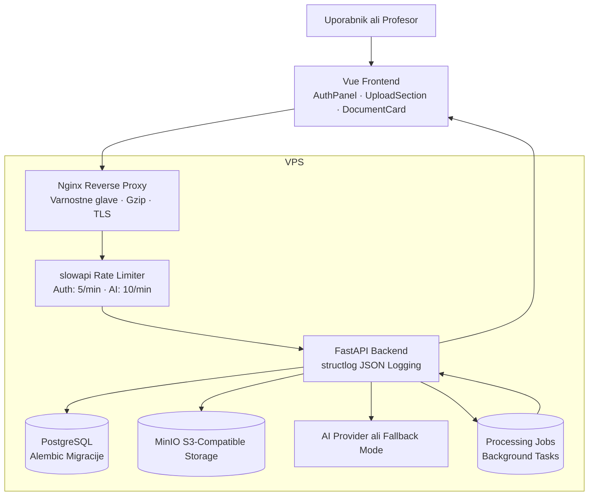
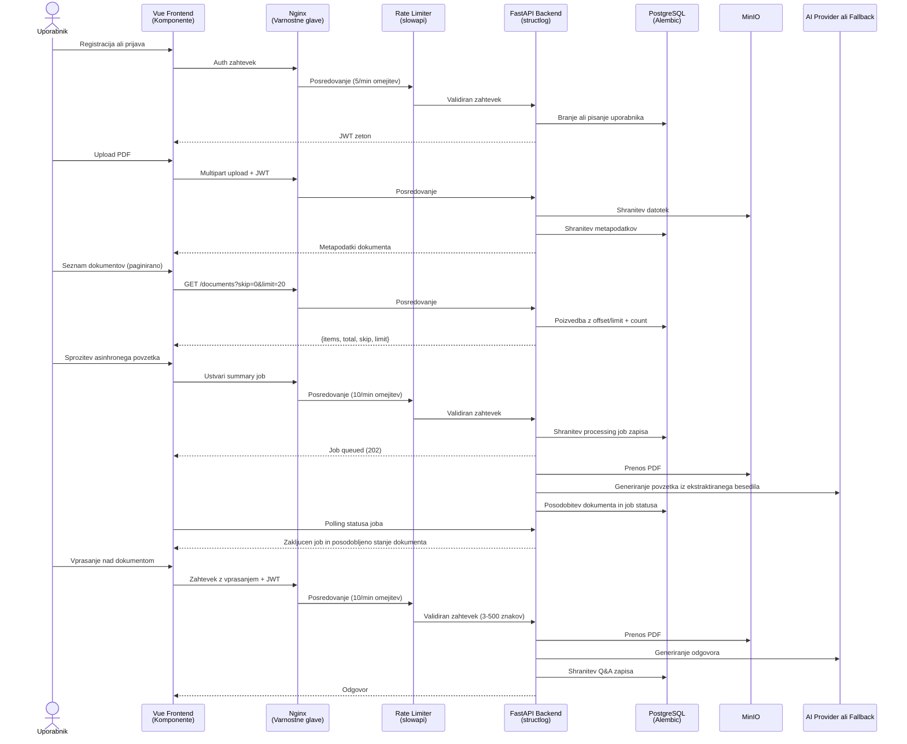

# Razvoj integrirane spletne storitve za varno upravljanje dokumentov z AI povzetki in dokumentnim Q&A v oblacni arhitekturi

## 1. Naslovnica

ALMA MATER EUROPAEA
Evropski center, Maribor

Program: Spletne in informacijske tehnologije

Predmet: Integracija spletnih strani in servisi

Studijsko leto: 2025/26

Nosilec predmeta: vis. pred. mag. Andrej Kositer

Vrsta naloge: MOZNOST 3 - Razvoj integrirane spletne storitve

Delovni naslov: Razvoj integrirane spletne storitve za varno upravljanje dokumentov z AI povzetki in dokumentnim Q&A v oblacni arhitekturi

Avtor: Michel Velkov

Produkcijski URL: https://doc-ai-assist.com

Repozitorij: https://github.com/mvelkov9/ai-document-assistant

## 2. Povzetek in kljucne besede

### Povzetek

Naloga obravnava razvoj integrirane spletne storitve za varno upravljanje dokumentov v vecuporabniskem okolju. Resitev je zasnovana kot spletna aplikacija, ki uporabnikom omogoca registracijo, prijavo, nalaganje PDF dokumentov, samodejno generiranje povzetkov in postavljanje vprasanj nad vsebino posameznega dokumenta. Arhitektura sistema temelji na sodobnem oblacnem pristopu, kjer se uporabniski vmesnik izvaja kot spletna aplikacija Vue, poslovna logika kot FastAPI storitev, metapodatki se hranijo v relacijski bazi PostgreSQL, datoteke pa v objektni hrambi MinIO, ki je zdruzljiva z API-jem S3. Dodatna plast sistema omogoca integracijo z zunanjim AI ponudnikom ali uporabo lokalnega fallback nacina, kar zmanjsa strosek razvoja in omogoca demonstracijo tudi v omejenem okolju.

Poseben poudarek naloge je na integraciji storitev, varnosti in operativni izvedljivosti. Sistem uporablja JWT avtentikacijo, lastnistveno omejevanje dostopa do dokumentov, health in readiness endpointa, osnovno request logiranje ter produkcijsko usmerjen Docker Compose deployment na lastnem VPS strezniku. Za dolgotrajnejse operacije je implementiran tudi asinhroni obdelovalni model z obstojnimi job zapisi, kar izboljsa uporabnisko izkusnjo in realistično odraza sodobno arhitekturo storitev v oblaku.

Naloga dokazuje, da je mogoce z uporabo odprtokodnih tehnologij in omejenega proracuna razviti arhitekturno relevantno, varno in razsirljivo spletno storitev, ki odgovarja potrebam manjse slovenske organizacije. Poleg implementacije naloga vsebuje se varnostno presojo, stroškovno analizo, kriticno primerjavo z alternativo na upravljanih platformah in usmeritve za nadaljnji razvoj.

### Kljucne besede

oblak, FastAPI, Vue, PostgreSQL, MinIO, AI, JWT, Docker, VPS, OpenAPI, Groq, RAG, BM25, TLS

## 3. Abstract and Keywords

### Abstract

This project presents the development of an integrated web service for secure multi-user document management. The solution allows users to register, log in, upload PDF documents, generate AI-based summaries, and ask questions about the content of a selected document. The system follows a modern cloud-oriented architecture where the frontend is implemented in Vue, the backend in FastAPI, metadata is stored in PostgreSQL, and uploaded files are stored in MinIO, an S3-compatible object storage service. The AI layer supports multiple external providers (Groq with Llama 4 Scout, Google Gemini, or OpenAI) with automatic fallback, which reduces mandatory costs and allows demonstration in constrained environments. A RAG-lite approach using BM25 ranking of document chunks is implemented for contextual Q&A.

The project focuses strongly on service integration, security, and operational feasibility. The implementation includes JWT-based authentication, ownership-based access control, health and readiness endpoints, structured JSON logging (structlog), Prometheus metrics, and a production Docker Compose deployment on a Hetzner CX33 VPS at https://doc-ai-assist.com with Let's Encrypt TLS. Long-running operations are handled through an asynchronous processing workflow with persistent job records, which makes the architecture more realistic and scalable. The system includes 39 automated tests, a GitHub Actions CI pipeline, and an admin panel with user role management.

The project demonstrates that an architecturally relevant and secure cloud-style service can be implemented using open technologies and a limited budget. In addition to implementation details, the report includes a security review, cost analysis, and a critical comparison with a managed-platform alternative.

### Keywords

cloud, FastAPI, Vue, PostgreSQL, MinIO, AI, JWT, Docker, VPS, OpenAPI, Groq, RAG, BM25, TLS

## 4. Uvod

Digitalni dokumenti so v skoraj vseh organizacijah osrednji nosilec informacij. Kljub temu so dokumenti pogosto shranjeni v razprsenih mapah, skupnih diskih ali ad hoc sistemih brez ustreznega nadzora dostopa, brez sledljivosti in brez moznosti hitrega povzemanja vsebine. To povzroca izgubo casa, tezjo uporabo dokumentov in vecje tveganje za varnostne napake.

Sodobni oblačni pristopi omogocajo integracijo spletnih storitev, objektne hrambe, relacijskih baz, avtentikacije in AI funkcionalnosti v enotno storitev, ki je dostopna vec uporabnikom in primerna tako za razvoj kot za produkcijsko uporabo. V okviru te naloge je bil izbran razvoj storitve, ki zdruzuje te elemente v konkretno resitev za manjsa podjetja ali interne organizacijske ekipe.

Cilj naloge je razviti spletno storitev, ki ne bo zgolj tehnicni prototip, temvec arhitekturno utemeljena integrirana resitev. To pomeni, da mora biti jasna delitev med komponentami, evidentni podatkovni tokovi, definirani varnostni mehanizmi, ocenjeni stroški in utemeljena izbira infrastrukture.

Pri delu je bila uporabljena iterativna metodologija. Najprej je bil definiran scenarij uporabe in arhitekturni okvir, nato je sledilo postopno uvajanje glavnih gradnikov: avtentikacije, persistentne podatkovne plasti, hrambe dokumentov, AI funkcionalnosti, asinhrone obdelave, uporabniskega vmesnika in produkcijske poti na VPS. Tak pristop je omogocil sprotno preverjanje konceptov in dosledno dokumentiranje po fazah.

Razvojni cikel je bil strukturiran v 18 faz, od katerih vsaka naslavlja dolocen vidik sistema. Dokumentacija za vsako fazo je vodena v loceni datoteki znotraj repozitorija (`docs/phase-01` do `docs/phase-18`), kar omogoca sledljivost odlocitev in kasnejso revizijo. Taksna fazna razdelitev je olajsala razvoj, saj je vsak korak prinsel merljiv rezultat, ki ga je bilo mogoce preveriti pred nadaljevanjem.

## 5. Problem in cilji

### 5.1 Problem

Osnovni problem, ki ga naslovlja naloga, je neučinkovito upravljanje dokumentov v organizacijskem okolju. Uporabniki pogosto potrebujejo hiter vpogled v vsebino internih dokumentov, vendar je iskanje kljucnih informacij zamudno. Obenem je pri uporabi zunanjih AI orodij pogosto prisoten problem zasebnosti, stroškov in pomanjkanja integracije z obstoječo infrastrukturo.

### 5.2 Cilji

Glavni cilji razvoja so:

1. izdelati večuporabniško spletno storitev z avtentikacijo in avtorizacijo,
2. implementirati REST API z OpenAPI dokumentacijo,
3. povezati aplikacijo z objektno hrambo za PDF dokumente,
4. dodati AI povzemanje in osnovni dokumentni Q&A,
5. pripraviti deployment model za lastni VPS,
6. dokumentirati varnostne, stroškovne in arhitekturne posledice izbrane zasnove.

## 6. Poslovni scenarij uporabe

Resitev je zasnovana za manjso slovensko organizacijo, ki upravlja interne pravilnike, navodila, porocila in tehnicno dokumentacijo. Uporabniki potrebujejo sistem, v katerega lahko nalozijo dokument, ga pozneje ponovno najdejo, pregledajo AI povzetek in nad njim zastavijo konkretno vprasanje.

Primer uporabe je podjetje, ki zaposlenim redno posreduje interne procedure. Namesto rocnega branja daljsih PDF dokumentov uporabnik dokument nalozi v sistem in pridobi povzetek. Ce potrebuje bolj usmerjeno informacijo, lahko postavi vprasanje, na primer kateri del pravilnika ureja obravnavo obcutljivih dokumentov. Sistem mu vrne odgovor na podlagi vsebine konkretnega dokumenta.

Tak scenarij je primeren za ocenjevanje, ker vkljucuje vecuporabnisko okolje, integracijo s hrambo, obdelavo vsebine dokumentov, varnostno omejevanje dostopa in jasno produkcijsko pot v oblaku.

## 7. Arhitekturni opis resitve

### 7.1 Logična arhitektura

Sistem je zasnovan kot modularni monolit z zunanjimi integracijami. Sestavljajo ga naslednje komponente:

> 📸 **[POSNETEK 1: Arhitekturni diagram]** — Renderaj Mermaid diagram iz `docs/diagrams/architecture.mmd` v PNG (uporabi https://mermaid.live/). Vstavi kot **Slika 1 — „Logična arhitektura sistema“** v Word.

1. Vue frontend z Vue Router 4 za uporabniški vmesnik (sidebar navigacija z lazy-loaded stranmi: Dokumenti, Naloži, Profil in Admin),
2. FastAPI backend za REST API in poslovno logiko s strukturiranim JSON logiranjem (structlog),
3. PostgreSQL za hrambo metapodatkov in uporabniških zapisov, z Alembic migracijami za nadzorovano evolucijo sheme,
4. MinIO za objektno hrambo PDF dokumentov, združljiv z AWS S3 API,
5. AI storitvena plast s prioritetno verigo: Groq (Llama 4 Scout, brezplačno) → Gemini 2.0 Flash → OpenAI gpt-4o-mini → lokalni fallback,
6. RAG-lite BM25 chunking za kontekstualni Q&A — besedilo se razdeli na segmente, rangira po relevantnosti, AI dobi samo top 5 segmentov,
7. asinhroni job mehanizem za summary in Q&A obdelavo z obstojnimi job zapisi,
8. slowapi rate limiter za zaščito avtentikacijskih (5/min) in AI endpointov (10/min),
9. Prometheus metrike na `/metrics` endpointu za operativno opazljivost, z Grafana dashboardom za vizualizacijo (request rate, latenca, napake),
10. admin API z upravljanjem uporabniških vlog (promote/demote),
11. Nginx reverse proxy za produkcijsko izpostavitev storitve z varnostnimi glavami, gzip kompresijo in TLS (Let's Encrypt).

Ta zasnova omogoca jasno ločitev odgovornosti in hkrati ohranja dovolj nizko kompleksnost za študentski projekt.

Arhitekturni diagram (Mermaid notacija):

Diagram prikazuje, da vsi zahtevki uporabnika prehajajo skozi reverse proxy, ki dodaja varnostne glave in posreduje zahtevke rate limiterju. Backend komunicira s PostgreSQL, MinIO in AI plastjo. Asinhroni jobe se izvajajo v ozadju in ob zakljucku posodobijo stanje v bazi.

### 7.2 Deployment arhitektura

Produkcijski deployment teče na lastnem VPS strežniku pri Hetzner Cloud:

| Podrobnost | Vrednost |
|------------|----------|
| Ponudnik | Hetzner Cloud |
| Načrt | CX33 (4 vCPU, 8 GB RAM, 80 GB disk) |
| OS | Ubuntu 24.04 LTS |
| IP naslov | 178.104.25.28 |
| Domena | doc-ai-assist.com |
| TLS | Let's Encrypt (avtomatično podaljševanje) |
| URL | https://doc-ai-assist.com |

Na VPS teče Docker Compose sklad, ki vsebuje reverse proxy (Nginx z TLS), frontend (produkcijski build), backend (FastAPI), PostgreSQL in MinIO. Zunaj Docker mreže je javno izpostavljen le reverse proxy, medtem ko baza in objektna hramba ostaneta zasebni znotraj vsebnika oziroma internega omrežja.

Tak model ima dve pomembni prednosti. Prvic, omogoca nizje in bolj predvidljive stroške od vec samostojnih upravljanih storitev. Drugic, lokalno razvojno okolje ostane zelo podobno produkciji, kar zmanjsa tveganje za razlike med razvojem in dejanskim zagonom.

Docker okolje je razdeljeno na dva profila:

- **Razvojni profil** (`docker-compose.yml`): frontend tece v dev nacinu z Vite dev serverjem, backend je izpostavljen na portu 8000 za neposreden dostop, PostgreSQL in MinIO porti so dostopni za diagnostiko.
- **Produkcijski overlay** (`docker-compose.prod.yml`): frontend uporablja multi-stage Dockerfile (dev → build → nginx produkcija), backend port je skrit (dostopen le prek Nginx), storitve imajo definirane healthcheke in restart politike, PostgreSQL in MinIO porti niso izpostavljeni navzven.

Backend Dockerfile ustvari namenskega non-root uporabnika (`appuser`) in aplikacijo izvaja z omejenimi pravicami, kar je skladno s principom najmanjsih privilegijev (least privilege). Frontend Dockerfile v produkcijskem nacinu zgradi staticne datoteke in jih streže prek lahkega Nginx procesa.

Arhitekturni diagram je pripravljen tudi kot Mermaid artefakt v `docs/diagrams/architecture.mmd`.

### 7.3 Arhitekturne odločitve

Izbira FastAPI je bila motivirana z enostavno izdelavo REST API, samodejno OpenAPI dokumentacijo in dobro podporo za asinhrone operacije. Vue je primeren zaradi majhne kompleksnosti, hitrega razvoja in preglednega uporabniškega toka — frontend je razdeljen na več strani (LandingPage, DocumentsPage, UploadPage, ProfilePage, AdminPage) z Vue Router 4 in composable state management vzorcem (`useStore.js`), kar izboljša preglednost, vzdrževljivost in omogoča lazy-loading posameznih strani za boljšo zmogljivost.

MinIO je bil izbran zato, ker omogoča lokalno in produkcijsko uporabo enakega S3-kompatibilnega pristopa, kar izboljša prenosljivost arhitekture. Za podatkovno bazo je bil izbran PostgreSQL s SQLAlchemy ORM in Alembic migracijami, kar omogoča nadzorovano evolucijo sheme brez ročnega poseganja v bazo.

Za AI integracijo je bila izbrana prioritetna veriga ponudnikov: Groq (Llama 4 Scout 17B-16E) kot primarni ponudnik (brezplačen API z visoko hitrostjo, 750 tok/s), Google Gemini 2.0 Flash kot prvi fallback, OpenAI gpt-4o-mini kot drugi fallback, in lokalni hevristični povzetek kot zadnja možnost. Ta pristop zagotavlja delovanje sistema ne glede na razpoložljivost posameznega ponudnika.

Za dokumentni Q&A je bil implementiran RAG-lite pristop z BM25 algoritmom (rank-bm25). Besedilo PDF dokumenta se razdeli na segmente po ~800 besed z 200-besednim prekrivanjem, segmenti se rangirajo po relevantnosti za zastavljeno vprašanje (BM25, k1=1,5, b=0,75), top 5 segmentov pa se pošlje AI ponudniku. Ta pristop je učinkovitejši od pošiljanja celotnega dokumenta, saj zmanjša porabo tokenov in izboljša kakovost odgovorov.

Backend vsebniki tečejo kot non-root uporabnik (appuser), kar zmanjša posledice morebitne varnostne ranljivosti. Frontend uporablja multi-stage Docker build: razvojna faza poganja Vite dev server, produkcijska faza pa gradi statične datoteke in jih streže prek lahkega Nginx procesa.

### 7.4 Podatkovni model

Relacijska baza vsebuje stiri glavne tabele:

- **users** — uporabniski racuni z email naslovom, bcrypt hash geslom in vlogo (user/admin)
- **documents** — metapodatki o nalozenih PDF dokumentih, vkljucno z lastnikom, kljucem v objektni hrambi, statusom obdelave in morebitnim povzetkom
- **processing_jobs** — zapisi asinhronih obdelovalnih nalog (summary, question), s statusom (queued, running, completed, failed), vhodom job_input in rezultatom
- **question_answers** — trajni zapisi vprasanj in odgovorov nad posameznim dokumentom, vkljucno z nacinom generiranja (provider ali fallback)

Shema je upravljana z Alembic migracijami. Zacetna migracija (`001_initial.py`) ustvari vse stiri tabele. Ob produkcijskem zagonu deploy skripta izvede `alembic upgrade head` pred zagonom aplikacije.

### 7.5 API zasnova

Backend izpostavlja 22 REST endpointov, razdeljenih v šest logičnih skupin:

| Skupina | Endpointi | Opis |
| --- | --- | --- |
| Zdravje | `GET /health`, `GET /ready`, `GET /metrics` | Health check, preverjanje odvisnosti, Prometheus metrike |
| Avtentikacija | `POST /auth/register`, `POST /auth/login`, `GET /auth/me` | Registracija, prijava, profil trenutnega uporabnika |
| Dokumenti | `POST /documents/upload`, `GET /documents`, `GET /documents/{id}`, `GET /documents/{id}/download`, `DELETE /documents/{id}`, `POST /documents/{id}/summarize`, `POST /documents/{id}/summarize-jobs`, `POST /documents/{id}/ask`, `POST /documents/{id}/ask-jobs`, `GET /documents/{id}/answers` | CRUD, prenos PDF, povzemanje, Q&A (sinhrono in asinhrono), zgodovina odgovorov |
| Jobe | `GET /jobs/{id}` | Preverjanje statusa asinhrone obdelave |
| Admin | `GET /admin/users`, `GET /admin/stats`, `PATCH /admin/users/{id}/role` | Seznam uporabnikov, statistike, upravljanje vlog |
| Status | `GET /api/v1/status` | Pregled konfiguracije in zmožnosti API |

Vsi endpointi imajo definirane `summary` in `description` parametre za OpenAPI dokumentacijo, ki je dostopna na `/docs` (Swagger UI) in `/redoc` (ReDoc).

## 8. Analiza integracije in podatkovnih tokov

> 📸 **[POSNETEK 2: Podatkovni tok diagram]** — Renderaj Mermaid diagram iz `docs/diagrams/data-flow.mmd` v PNG (uporabi https://mermaid.live/). Vstavi kot **Slika 2 — „Podatkovni tokovi sistema“** v Word.

### 8.1 Registracija in prijava

Uporabnik v uporabniskem vmesniku vnese podatke za registracijo ali prijavo. Backend ob registraciji ustvari uporabnika, zasciti geslo s hash funkcijo in ga shrani v relacijsko bazo. Ob prijavi backend preveri veljavnost poverilnic in izda JWT dostopni zeton. Frontend zeton shrani lokalno in ga posilja v glavi zahtevkov pri vseh zascitenih endpointih.

### 8.2 Upload dokumenta

Ko prijavljen uporabnik nalozi PDF, backend najprej preveri tip in velikost datoteke. Datoteka se nato shrani v MinIO bucket, v PostgreSQL pa se zapiše metapodatek: lastnik dokumenta, ime datoteke, ključ v objektni hrambi, velikost, tip in stanje obdelave. Ta tok dokazuje dejansko integracijo med spletno storitvijo, podatkovno bazo in objektno hrambo.

### 8.3 Povzemanje dokumenta

Za generiranje povzetka sistem uporablja prioritetno verigo AI ponudnikov. Primarni ponudnik je Groq (Llama 4 Scout 17B-16E), ki ponuja brezplačen API z visoko hitrostjo (~750 tok/s). Če Groq ni dostopen, sistem samodejno preklopi na Google Gemini 2.0 Flash ali OpenAI gpt-4o-mini. Če nobena zunanja integracija ni na voljo, sistem uporabi lokalni fallback povzetek, kar omogoča delovanje tudi v nizkocenovnem ali demo okolju. Povzetek teče asinhrono: frontend ustvari job, backend ga obdela v ozadju, rezultat pa je dostopen prek pollinga statusa.

### 8.4 Dokumentni Q&A

Uporabnik lahko na ravni posameznega dokumenta odda vprašanje. Backend iz MinIO pridobi datoteko, iz PDF-ja izlušči besedilo, ga razdeli na segmente (RAG-lite pristop) in z BM25 algoritmom (k1=1,5, b=0,75) rangira segmente po relevantnosti za zastavljeno vprašanje. Top 5 najrelevantnejših segmentov se pošlje AI ponudniku, ki generira kontekstualni odgovor. Vprašanje in odgovor se trajno shranita v bazo, kar omogoča sledljivost in kasnejšo razširitev v bolj bogat pogovorni vmesnik. Ta pristop je učinkovitejši od pošiljanja celotnega dokumenta, saj zmanjša porabo tokenov in izboljša kakovost odgovorov.

Podatkovni tokovi za prijavo, upload, asinhroni povzetek in dokumentni Q&A so zbrani v naslednjem diagramu:

Diagram prikazuje celoten zivljenjski cikel podatkov od registracije do dokumentnega Q&A. Vsak zahtevek prehaja skozi Nginx (varnostne glave), nato skozi rate limiter (za obcutljive endpointe), in koncno do backend logike, ki komunicira z bazo, objektno hrambo in AI storitvijo.

Podrobnejsa datoteka diagramov je dostopna v repozitoriju (`docs/diagrams/data-flow.mmd`).

## 9. Analiza varnosti

### 9.1 Identiteta in dostop

Sistem uporablja JWT avtentikacijo (algoritem HS256) z uporabo knjiznice python-jose. Uporabnik po uspesni prijavi prejme podpisan zeton, ki ga uporablja za dostop do zascitenih endpointov. Lastnistvo dokumentov je preverjeno na ravni backend logike, tako da uporabnik ne more dostopati do dokumentov drugega uporabnika samo z ugibanjem identifikatorja.

Ob zagonu v produkcijskem nacinu sistem preverja, da privzeti skrivni kljuc (`SECRET_KEY`) ni ostal na demo vrednosti, saj bi to pomenilo kriticno varnostno ranljivost.

### 9.2 Zascita gesel

Gesla se ne hranijo v cisti obliki, ampak zgolj kot bcrypt hash vrednosti (knjiznica passlib). Gesla morajo imeti najmanj 8 znakov in najvec 128 znakov. Email naslovi se validirajo s knjiznico email-validator. To je osnovni, vendar nujni varnostni ukrep za vse resne spletne storitve.

### 9.3 Zascita dokumentov

Dokumenti niso javno dostopni v objektni hrambi. Dostop do njih poteka skozi aplikacijsko logiko, kar omogoca centraliziran nadzor. V produkciji je dodatno pomembno, da MinIO ni neposredno izpostavljen javnemu omrezju.

### 9.4 Omejitev hitrosti zahtevkov (rate limiting)

Za zascito pred brute-force napadi in prekomerno uporabo je implementirano omejevanje hitrosti zahtevkov z uporabo knjiznice slowapi. Avtentikacijski endpointi (registracija in prijava) so omejeni na 5 zahtevkov na minuto na IP naslov. AI endpointi (povzemanje in Q&A) so omejeni na 10 zahtevkov na minuto. Ob prekoracitvi uporabnik prejme standardni HTTP odgovor 429 (Too Many Requests).

### 9.5 Varnostne glave in reverse proxy

Nginx reverse proxy v produkcijskem nacinu dodaja naslednje varnostne glave HTTP odgovorom:

- `X-Content-Type-Options: nosniff` — preprecitev MIME-type sniffinga
- `X-Frame-Options: DENY` — zascita pred clickjackingom
- `X-XSS-Protection: 1; mode=block` — dodatna XSS zascita v starejsih brskalnikih
- `Referrer-Policy: strict-origin-when-cross-origin` — nadzor nad referrer podatki
- `Content-Security-Policy` — omejevanje virov skript, stilov in povezav

Dodatno je aktivirana gzip kompresija za besedilne vsebine in omejitev velikosti nalaganja datotek (`client_max_body_size`).

### 9.6 Validacija vhodnih podatkov

Vsi vhodni podatki so validirani z uporabo Pydantic shem. Vprasanja pri dokumentnem Q&A morajo imeti najmanj 3 in najvec 500 znakov, kar prepreci zlorabo z izjemno dolgimi vnosi. Email format se validira na ravni sheme, imena datotek pa se sanitizirajo ob nalaganju.

### 9.7 Strukturirano logiranje

Backend uporablja knjiznico structlog za strukturirano JSON logiranje. Vsak HTTP zahtevek se belezi z metodo, potjo, statusno kodo in trajanjem v milisekundah. Globalni exception handler prepreci uhajanje notranjih podrobnosti napak (stack trace) v produkcijskem odgovoru — uporabnik prejme le genericno sporocilo, podrobnosti pa se zapisejo v dnevnik.

### 9.8 CORS in OWASP Top 10

CORS politika je omejene: dovoljene so le metode GET, POST in OPTIONS, le glave Authorization in Content-Type. V kontekstu OWASP Top 10 (2021) sistem naslavlja:

- **A01 Broken Access Control** — lastnistveno preverjanje za dokumente
- **A02 Cryptographic Failures** — bcrypt hash za gesla, HS256 za JWT
- **A03 Injection** — Pydantic validacija, SQLAlchemy ORM namesto surovega SQL
- **A04 Insecure Design** — modularna arhitektura z loceno podatkovno, storitveno in API plastjo
- **A05 Security Misconfiguration** — startup validacija skrivnega kljuca, varnostne glave
- **A07 Identification and Authentication Failures** — rate limiting na avtentikacijskih endpointih

### 9.9 Tveganja AI integracije

AI integracija prinaša več posebnih tveganj:

1. uhajanje obcutljivih podatkov do zunanjega ponudnika,
2. prompt injection zlonamerno oblikovanih dokumentov,
3. variabilni stroški ob večjem številu zahtevkov,
4. netocni ali halucinirani odgovori.

Za zmanjsanje tveganja je bila uvedena fallback moznost brez zunanje storitve, omejitev velikosti dokumentov in arhitekturna zamenljivost AI adapterja.

### 9.10 Znana omejitev: JWT v localStorage

JWT dostopni zeton se v frontendu hrani v localStorage. To predstavlja potencialno XSS ranljivost, saj JavaScript na strani brskalnika lahko dostopa do te vrednosti. Alternativa je uporaba httpOnly piskotka, ki pa zahteva dodatno kompleksnost pri CSRF zasciti in ne omogoca enostavne rabe z Bearer shemo. Za obseg te naloge je izbira dokumentirana in sprejemljiva; v produkcijskem sistemu bi bila potrebna nadgradnja.

### 9.11 Povzetek tveganj in ukrepov

| Tveganje | Posledica | Trenutni ukrep | Naslednji korak |
| --- | --- | --- | --- |
| Brute-force prijava | nepooblascen dostop | rate limiting (5/min na IP) | account lockout po N neuspesnih poskusih |
| Uhajanje podatkov do zunanjega AI ponudnika | pravna in poslovna tveganja | fallback nacin brez zunanjega AI API | anonimizacija ali strozji izbor dokumentov za AI obdelavo |
| Nedostopnost baze ali MinIO | nedelovanje storitve | readiness endpoint in healthchecki | opozorila in avtomatizirano spremljanje stanja |
| Napacna ali halucinirana AI vsebina | napacne odlocitve uporabnika | odgovor je vezan na konkreten dokument, ne na odprt klepet | prikaz opozorila in moznost revizije odgovora |
| Rast AI stroskov | nepredvidljiv operativni strosek | fallback nacin in modularen AI adapter | omejitve porabe, merjenje uporabe in izbira cenejsega modela |
| XSS napad na JWT | kraja uporabniskega zetona | sanitizacija vhodov, CSP glave | prehod na httpOnly piskotke |
| Preobremenitev aplikacijskega procesa | slabsa odzivnost pri vecjem prometu | asinhroni job zapis in polling | namenska worker komponenta |

## 10. Stroškovna analiza

### 10.1 Konkretna stroškovna tabela

| Postavka | Demo / izpitni zagon | Manjša organizacija | Opomba |
| --- | --- | --- | --- |
| VPS (Hetzner CX33, 4 vCPU, 8 GB RAM) | €5,49/mesec | €5,49/mesec | Vsi vsebniki na enem strežniku |
| Domena (.com — Namecheap) | €7,99/leto (~€0,67/mesec) | €7,99/leto | doc-ai-assist.com |
| TLS certifikat (Let's Encrypt) | brezplačno | brezplačno | Avtomatizirano podaljševanje (certbot timer) |
| Objektna hramba (MinIO na VPS) | vključeno v VPS | vključeno v VPS | Do ~40 GB na disku CX33 |
| AI API — Groq (Llama 4 Scout) | brezplačno | brezplačno | Free tier; fallback: Gemini, OpenAI |
| Upravljanje baze (PostgreSQL na VPS) | vključeno v VPS | vključeno v VPS | Docker container |
| Prometheus + Grafana | vključeno v VPS | vključeno v VPS | Metrike, dashboard |
| **Skupaj mesečno** | **~€6–7** | **~€6–7** | |

### 10.2 Primerjava z upravljano alternativo (Managed PaaS)

| Postavka | VPS pristop | Managed PaaS (AWS/GCP ekvivalent) |
| --- | --- | --- |
| Compute | €5,49/mesec (Hetzner CX33) | €15–40/mesec (App Platform, Cloud Run) |
| Baza | vključeno (Docker PostgreSQL) | €10–25/mesec (managed DB) |
| Objektna hramba | vključeno (MinIO) | €1–5/mesec (S3) |
| AI API | brezplačno (Groq free tier) | €0–15/mesec (OpenAI / Groq plačljiv) |
| **Skupaj** | **~€6–7/mesec** | **€30–85/mesec** |

Managed PaaS poenostavi operativni del, vendar vsaj 3–5× podrazzi mesecne stroske za primerljiv obseg. Za studentski projekt in manjso slovensko organizacijo je VPS pristop bistveno cenejsi, z dodatno odgovornostjo za sistemsko administracijo.

### 10.3 Razsirjeni scenarij

V razširjenem scenariju se poveča število uporabnikov in dokumentov. Povečata se potreba po več prostora v objektni hrambi in bazi ter število AI poizvedb. Trenutno je Groq API brezplačen z omejitvijo hitrosti (30 zahtevkov/minuto), kar je dovolj za manjšo organizacijo. Če bi Groq omejil free tier, sistem samodejno preklopi na Gemini ali OpenAI, kjer bi strošek pri ~500 AI poizvedbah mesečno znašal ~€5–10/mesec, skupaj torej ~€8–15/mesec.

### 10.4 Skalirani scenarij

Pri vecjem stevilu uporabnikov ali pogostem AI prometu glavni strosek ni vec zgolj VPS, ampak AI obdelava. Takrat bi bilo smiselno razmisliti o locenem workerju, vektorski shrambi, boljsi observability plasti in morda o delni uporabi upravljanih storitev. Prehod na vecji VPS (npr. Hetzner CX32 za ~€8/mesec) bi bil smiseln sele ob presezeni kapaciteti RAM-a.

## 11. Kriticna ocena primernosti

### 11.1 Prednosti rešitve

Izbrana resitev je primerna za organizacijo, ki potrebuje cenovno ucinkovit sistem za dokumente in noce biti popolnoma odvisna od dragih upravljanih platform. Velika prednost je arhitekturna jasnost: uporabniki, dokumenti, objektna hramba, AI integracija in produkcijski deployment so jasno razmejeni.

Dodatna prednost je modularna zasnova AI plasti. Sistem ne uporablja le enega ponudnika, temveč prioritetno verigo (Groq → Gemini → OpenAI → hevristični fallback), kar zagotavlja delovanje ne glede na razpoložljivost posameznega zunanjega API-ja. RAG-lite pristop z BM25 rangiranjem segmentov dokumenta zagotavlja, da AI ponudnik prejme le najrelevantnejše dele besedila, kar zmanjša porabo tokenov in izboljša kakovost odgovorov.

Projekt vključuje tudi celovit testni nabor (107 avtomatiziranih testov v 9 datotekah s ~90-odstotno pokritostjo), kar je za študentski projekt nadpovprečno in dokazuje zrelost razvojnega procesa.

### 11.2 Slabosti in omejitve

Slabosti resitve so predvsem operativne. VPS zahteva samostojno skrb za posodobitve, TLS in delovanje vsebnikov. Varnostne kopije so avtomatizirane s skripto `backup.sh`, ki izvaja šifrirane posnetke (GPG AES-256) podatkovne baze in objektne hrambe z 7-dnevno rotacijo. Poleg tega je trenutna asinhrona obdelava izvedena z background task pristopom v aplikaciji, kar je dovolj za manjši obseg, ni pa idealno za vecjo obremenitev.

CI/CD pipeline vključuje tako neprekinjeno integracijo (lint, testi, build) kot neprekinjeno dostavo — ob uspešnem push na `main` vejo se avtomatsko sproži SSH deploy na produkcijski VPS (6. job v GitHub Actions). Skripta `deploy.sh` posodobi vsebnike brez ročnega posega.

Frontend je v različici v1.3.0 nadgrajen z Vue Router 4, ki omogoča prave URL poti (`/documents`, `/upload`, `/profile`, `/admin`) in lazy-loading posameznih strani. Skupno stanje je centralizirano v composable modulu (`useStore.js`) namesto Pinia/Vuex, kar ohranja enostavnost brez zunanjega upravljalnika stanja. Navigacijska zaščita (navigation guards) preprečuje dostop neprijavljenim uporabnikom in omejuje admin strani. Uporabniški vmesnik vključuje sidebar navigacijo z router-link elementi, iskanje, sortiranje, administracijsko ploščo in odzivno zasnovo.

V različici v1.3.2 je frontend dodatno izboljšan z naslednjimi funkcionalnostmi:

- **Persistenca Q&A zgodovine**: vprašanja in odgovori se zdaj nalagajo iz backend API-ja (`GET /documents/{id}/answers`) ob zagonu seje, kar prepreči izgubo podatkov ob osvežitvi strani. Uporabnik lahko postavi več zaporednih vprašanj, ki se prikažejo kronološko,
- **Zložljive dokumentne kartice**: kartice dokumentov se samodejno zložijo od 4. dokumenta naprej, kar izboljša preglednost pri večjem številu dokumentov. Vsaka kartica ima gumb za razširitev/zložitev,
- **Favicon**: aplikacija ima lastno ikono v brskalniku (SVG z gradientom v barvah aplikacije),
- **Sledenje zadnje prijave**: uporabniški model vključuje polje `last_login_at`, ki se posodobi ob vsaki prijavi. Profilna stran prikazuje tako datum registracije kot datum zadnje prijave,
- **Sidebar povezave za orodja**: administratorji imajo v stranski navigaciji neposredne povezave do API Docs (Swagger UI) in ReDoc dokumentacije.

V različici v1.4.0 so dodane naslednje izboljšave uporabniškega vmesnika:

- **Temni način (dark mode)**: toggle gumb v stranski navigaciji omogoča preklop med svetlim in temnim načinom. Izbira se trajno shrani v localStorage. Celoten nabor CSS spremenljivk se prepiše za temno temo, kar zagotavlja konsistentno vizualno izkušnjo,
- **Statistične kartice na pregledu dokumentov**: nad seznamom dokumentov se prikazujejo 4 kartice s statistikami — število dokumentov, generiranih povzetkov, zastavljenih vprašanj in odstotek obdelanih dokumentov,
- **Kopiranje povzetka v odložišče**: vsak generirani povzetek ima gumb »Kopiraj«, ki z uporabo Clipboard API prekopira besedilo v sistemsko odložišče z vizualnim potrditvenim odzivom,
- **Izboljšane animacije med AI obdelavo**: med generiranjem povzetka ali odgovora se na kartici dokumenta prikaže animiran svetleči trak in pulzirajoč okvir, ki uporabniku jasno sporočata, da operacija teče.

V različici v1.4.1 je dodana podpora za skenirane in slikovne PDF dokumente:

- **Tristopenjska ekstrakcija besedila**: sistem najprej poskuša z PyMuPDF (MuPDF), ki bistveno bolje obdeluje kompleksne pisave, tabele in kodiranja kot pypdf. Če PyMuPDF vrne premalo besedila (< 50 znakov), se poskuša s pypdf (vključno z layout načinom). Če tudi pypdf ne uspe, se aktivira OCR,
- **OCR za skenirane dokumente (Tesseract)**: vsaka stran PDF-ja se renderira v sliko pri 300 DPI z uporabo PyMuPDF-ja, nato pa Tesseract opravi optično prepoznavanje znakov. Podprta sta slovenščina (`slv`) in angleščina (`eng`),
- **Robustna obravnava napak**: vsaka stopnja ekstrakcije samostojno obravnava napake (poškodovani PDF, prazen tok bajtov), kar zagotavlja, da sistem nikoli ne preneha delovati — najslabši rezultat je prazen niz, ne pa sesutje aplikacije.

### 11.3 Razlikovanje od enostavne uporabe AI orodij

Pomembno je poudariti, v čem se ta rešitev razlikuje od neposredne uporabe ChatGPT ali drugega AI orodja. Neposredna uporaba AI orodja omogoča posamezne poizvedbe brez konteksta, brez sledljivosti in brez integracije z obstoječo infrastrukturo. Implementirana rešitev pa ponuja:

1. **večuporabniško okolje** z avtentikacijo in lastnistvenim omejevanjem dostopa — vsak uporabnik vidi samo svoje dokumente,
2. **trajno hrambo dokumentov** v S3-kompatibilni objektni hrambi z metapodatki v relacijski bazi,
3. **RAG-lite pristop** — besedilo se razdeli na segmente in rangira z BM25, AI ponudnik prejme le top 5 segmentov, kar je učinkovitejše od pošiljanja celotnega dokumenta,
4. **stroškovno učinkovitost** — sistem stane ~€7/mesec na lastnem VPS, medtem ko komercialne AI storitve stanejo €20+/mesec na uporabnika,
5. **popoln nadzor nad podatki** — dokumenti ne zapustijo lastne infrastrukture (razen segmentov, ki se pošljejo AI ponudniku),
6. **operativno zrelost** — health checki, Prometheus metrike, strukturirano logiranje, CI pipeline, TLS.

Cilj naloge torej ni bil razvoj drugačnega AI modela, temveč integracija obstoječih AI storitev v varno, sledljivo in arhitekturno utemeljeno oblačno storitev.

Naslednja tabela primerja funkcionalnosti tega sistema z neposredno uporabo splošnega AI orodja:

| Vidik | Neposredna uporaba AI orodja (npr. ChatGPT) | Implementirana rešitev |
| --- | --- | --- |
| Uporabniki | Posameznik brez ločevanja | Večuporabniško okolje z JWT avtentikacijo in RBAC |
| Hramba dokumentov | Brez trajne hrambe; uporabnik ročno kopira besedilo | S3-kompatibilna objektna hramba (MinIO) z metapodatki v PostgreSQL |
| Kontekst vprašanj | Celoten dokument v enem sporočilu ali brez konteksta | RAG-lite: BM25 rangiranje segmentov, top-5 poslanih AI |
| Sledljivost | Brez revizijske sledi; pogovor se izbriše | Polna Q&A zgodovina s časovnimi žigi in virom odgovora |
| Infrastruktura | Odvisnost od ponudnika, brez nadzora nad podatki | Self-hosted VPS z TLS, monitoringom, CI/CD, backupi |
| Strošek | €20+/mesec/uporabnika za komercialno AI naročnino | ~€7/mesec skupno za celotno infrastrukturo |
| Operativna zrelost | Brez health checkov, metrik ali alertov | Prometheus/Grafana metrike, structlog, /ready endpoint |
| Rozširljivost | Brez možnosti prilagoditve logike | Modularna arhitektura s prioritetno verigo ponudnikov |

### 11.4 Primernost za slovensko organizacijo

Kljub omejitvam je resitev za izpitno nalogo zelo primerna, ker jasno demonstrira razumevanje spletne integracije, oblačne arhitekture, varnosti, stroškov in praktične implementacije.

Za manjsi slovenski kolektiv je dodatna prednost tudi to, da je celotno arhitekturo mogoce gostovati na enem razumljivo upravljanem okolju. Tak pristop olajsa razlago sistema vodstvu ali mentorju, ker ni treba uvajati vec ponudnikov ali kompleksnih pogodbenih odvisnosti ze v prvi iteraciji.

Po drugi strani tak model ni optimalen za okolja z visokimi zahtevami po skladnosti, neprekinjeni razpolozljivosti ali hitri organizacijski rasti. V takem primeru bi bilo treba del odgovornosti prestaviti na upravljane storitve, dodatne varnostne kontrole in locene obdelovalne komponente.

## 12. Implementacijska validacija

### 12.1 Uporabljena tehnologija

| Plast | Tehnologija | Verzija | Namen |
| --- | --- | --- | --- |
| Frontend | Vue | 3.5 | Enostrankovska aplikacija |
| Frontend routing | Vue Router | 4 | Lazy-loaded strani, navigacijska zaščita |
| Frontend teme | CSS Custom Properties | — | Svetli in temni način z localStorage persistenco |
| Frontend build | Vite | 5.4 | Razvojni strežnik in produkcijska gradnja |
| Backend | FastAPI | 0.116 | REST API, OpenAPI, asinhrona podpora |
| ORM | SQLAlchemy | 2.0 | Objektno-relacijsko mapiranje |
| Migracije | Alembic | 1.16 | Nadzorovana evolucija sheme |
| Baza | PostgreSQL | 17 | Relacijska hramba metapodatkov |
| Objektna hramba | MinIO | RELEASE.2025 | S3-kompatibilna hramba PDF datotek |
| Avtentikacija | python-jose, passlib | — | JWT (HS256), bcrypt hash |
| Rate limiting | slowapi | 0.1.9 | Omejevanje hitrosti zahtevkov |
| Logiranje | structlog | 25.4 | Strukturirano JSON logiranje |
| AI — primarni | Groq (Llama 4 Scout 17B-16E) | — | Generiranje povzetkov in odgovorov (brezplačno) |
| AI — fallback | Gemini 2.0 Flash, OpenAI gpt-4o-mini | — | Nadomestni ponudniki ob nedostopnosti Groq |
| RAG-lite | BM25 (rank-bm25) | — | Rangiranje segmentov dokumenta za Q&A |
| Metrike | Prometheus (prometheus-fastapi-instrumentator) | v3.4 | /metrics endpoint za operativno opazljivost |
| Monitoring | Grafana | 11.6 | Dashboard za vizualizacijo metrik (request rate, latenca, napake) |
| Admin API | FastAPI dependency | — | Administracijska plošča (uporabniki, statistika, vloge) |
| Reverse proxy | Nginx | 1.27 | Varnostne glave, gzip, TLS (Let's Encrypt) |
| Kontejnerizacija | Docker Compose | v2 | Razvojno in produkcijsko okolje |
| VPS gostovanje | Hetzner CX33 | Ubuntu 24.04 | 4 vCPU, 8 GB RAM, 80 GB disk |
| Domena in TLS | doc-ai-assist.com | Let's Encrypt | HTTPS z avtomatskim podaljševanjem |
| CI/CD | GitHub Actions | — | Lint, test s pokritostjo, Docker build, avtomatski deploy |
| PDF ekstrakcija | PyMuPDF (fitz) | 1.25 | Primarni ekstraktor besedila iz PDF (boljši od pypdf za kompleksne pisave) |
| OCR | Tesseract + pytesseract | 5.x / 0.3.13 | Optično prepoznavanje znakov za skenirane PDF dokumente |
| Obdelava slik | Pillow | 11.2 | Renderiranje PDF strani v slike za OCR |
| Lint | ruff | 0.11 | Preverjanje kakovosti Python kode |
| Testiranje | pytest, pytest-cov | — | 107 avtomatiziranih testov v 9 datotekah (~90 % pokritost) |

### 12.2 Razvojna validacija

Validacija projekta je potekala na več ravneh. Prva raven je bila razvojna validacija posameznih gradnikov, kjer so bili po posameznih fazah preverjeni Python moduli, testni primeri in konfiguracija Docker Compose.

Backend vsebuje **107 avtomatiziranih testov** v **9 testnih datotekah** s približno 90-odstotno pokritostjo kode, ki pokrivajo:

- **test_health.py** (5 testov) — zdravstveni endpointi (`/health`, `/ready`) in Prometheus metrike (`/metrics`),
- **test_auth.py** (8 testov) — registracija, prijava, profil uporabnika, napake pri avtentikaciji (napačno geslo, neveljaven token, podvojen email), admin zaščita endpointov,
- **test_documents.py** (11 testov) — nalaganje dokumentov, validacija tipov datotek, lastnistveno omejevanje dostopa med uporabniki, paginacija seznama dokumentov, prenos (download) dokumentov, brisanje dokumentov,
- **test_document_flow.py** (6 testov) — validacija dolžine vprašanj (prekratka in predolga vprašanja), sinhrono povzemanje in dokumentni Q&A, asinhrona obdelava z job polling mehanizmom,
- **test_admin_and_download.py** (9 testov) — administracijski endpointi (statistika platforme, seznam uporabnikov, sprememba vlog), zaščita admin endpointov, prenos dokumentov in cross-user preverjanje,
- **test_delete_and_admin.py** (11 testov) — brisanje dokumentov s kaskadnim čiščenjem Q&A zapisov in jobov, odpornost na napake pri hrambi, upravljanje uporabniških vlog,
- **test_storage_and_pdf.py** (16 testov) — MinIO upload/download/delete z mocki, obravnava S3 napak, PDF ekstrakcija besedila, layout-mode fallback, obravnava poškodovanih in praznih PDF datotek, graceful degradation za OCR fallback,
- **test_summary_service.py** (32 testov) — BM25 chunking in rangiranje, tokenizacija, fallback povzetki, detekcija ponudnikov (Groq → Gemini → OpenAI), generiranje povzetkov in odgovorov,
- **test_security.py** (9 testov) — bcrypt saltanje gesel, preverjanje gesel, potek žetona, zavrnitev potečenega žetona, zavrnitev manjkajočega uporabnika.

Testi se izvajajo z `pytest` in `pytest-cov`, pokritost kode je merjena in vključena v CI pipeline. Minimalni prag pokritosti je nastavljen na 70 %.

### 12.3 Operativna validacija

Produkcijski deployment je bil opravljen 11. marca 2026 na Hetzner CX33 VPS (Ubuntu 24.04). Postopek je vključeval:

1. **Inicializacija VPS** — namestitev Docker Engine, Docker Compose, kloniranje Git repozitorija,
2. **Konfiguracija .env** — nastavitev produkcijskih skrivnosti (PostgreSQL, MinIO, JWT, Groq API ključ),
3. **Zagon deploy.sh** — `docker compose -f docker-compose.yml -f docker-compose.prod.yml up -d --build`,
4. **Alembic migracija** — avtomatska inicializacija podatkovne sheme ob prvem zagonu,
5. **TLS certifikat** — pridobitev Let's Encrypt certifikata z orodjem certbot za domeno doc-ai-assist.com,
6. **DNS konfiguracija** — A zapisi na Namecheap (@ in www → 178.104.25.28).

Po uspešnem deploymentu so bili vsi vsebniki (backend, frontend/proxy, PostgreSQL, MinIO) v stanju healthy. Aplikacija je dostopna na **https://doc-ai-assist.com** z HSTS glavami in A+ TLS konfiguracijo.

> 📸 **[POSNETEK 13: Security headers]** — V terminalu poženi: `curl -I https://doc-ai-assist.com`. Vstavi kot **Slika 13 — „Varnostne glave HTTP odgovorov“** v Word.

> 📸 **[POSNETEK 14: docker compose ps]** — Na VPS poženi: `docker compose -f docker-compose.yml -f docker-compose.prod.yml ps`. Vstavi kot **Slika 14 — „Stanje Docker containerjev na VPS“** v Word.

> 📸 **[POSNETEK 15: Deploy script output]** — Na VPS poženi `bash infrastructure/scripts/deploy.sh` (ali uporabi prejšnji screenshot). Vstavi kot **Slika 15 — „Uspešen deployment na VPS“** v Word.

> 📸 **[POSNETEK 16: GitHub Actions CI]** — Odpri GitHub repo → Actions → zadnji zeleni pipeline. Vstavi kot **Slika 16 — „CI pipeline (GitHub Actions)“** v Word.

### 12.4 CI/CD pipeline

GitHub Actions CI/CD pipeline izvaja šest ločenih jobov ob vsakem push ali pull request:
1. **Backend lint** — preverjanje kakovosti Python kode z orodjem ruff (lint + format check),
2. **Backend test** — zagon vseh 107 testov s pokritostjo (minimalni prag 70 %), uporaba pytest-cov,
3. **Frontend lint** — preverjanje formatiranja s Prettier,
4. **Frontend build** — preverjanje gradnje Vue.js frontend aplikacije z Vite,
5. **Docker build** — preverjanje da se backend in frontend Docker sliki uspešno zgradita,
6. **Deploy** — avtomatski SSH deployment na produkcijski VPS po uspešnem CI (samo ob push na `main` vejo), z uporabo `appleboy/ssh-action`.

Prvih pet jobov mora uspeti, preden je pull request odobren za merge. Deploy job se sproži le ob push na glavno vejo, kar zagotavlja neprekinjeno dostavo (continuous deployment). Pipeline zagotavlja kompatibilnost z Node 24 in Python 3.13.

### 12.5 End-to-end validacija

Polna end-to-end validacija je bila opravljena na produkcijskem okolju (https://doc-ai-assist.com):

1. **Registracija in prijava** — ustvarjen nov uporabniški račun, pridobljen JWT token,

> 📸 **[POSNETEK 3: Landing page]** — Odpri https://doc-ai-assist.com (brez prijave). Vstavi kot **Slika 3 — „Začetna stran aplikacije“** v Word.

> 📸 **[POSNETEK 4: Registracija / Prijava]** — Klikni Registracija ali Prijava na landing page. Vstavi kot **Slika 4 — „Registracijski obrazec“** v Word.

2. **Nalaganje PDF dokumenta** — datoteka uspešno shranjena v MinIO, metapodatki v PostgreSQL,

> 📸 **[POSNETEK 5: Dashboard z dokumenti]** — Po prijavi — stran Dokumenti z naloženim PDF. Vstavi kot **Slika 5 — „Preglednica dokumentov“** v Word.

> 📸 **[POSNETEK 6: Upload stran]** — Klikni „Naloži“ v sidebar-u. Vstavi kot **Slika 6 — „Nalaganje dokumenta“** v Word.

3. **AI povzetek** — asinhroni job uspešno generiral povzetek prek Groq API,

> 📸 **[POSNETEK 7: AI povzetek]** — Na dokumentu klikni Povzemi in počakaj rezultat. Vstavi kot **Slika 7 — „AI-generiran povzetek dokumenta“** v Word.

4. **Dokumentni Q&A** — vprašanje nad dokumentom vrnilo kontekstualni odgovor z RAG-lite BM25 pristopom,

> 📸 **[POSNETEK 8: Q&A primer]** — Postavi vprašanje nad dokumentom. Vstavi kot **Slika 8 — „Dokumentni Q&A — vprašanje in odgovor“** v Word.

5. **Prenos dokumenta** — originalna PDF datoteka prenesena prek `/documents/{id}/download`,
6. **Admin plošča** — statistika platforme, seznam uporabnikov, sprememba vlog,

> 📸 **[POSNETEK 9: Admin panel]** — Klikni Admin v sidebar-u (kot admin uporabnik). Vstavi kot **Slika 9 — „Administracijska plošča“** v Word.

> 📸 **[POSNETEK 10: User profil]** — Klikni Profil v sidebar-u. Vstavi kot **Slika 10 — „Uporabniški profil“** v Word.

7. **Swagger UI in ReDoc** — interaktivna OpenAPI dokumentacija dostopna na `/docs` in `/redoc`,

> 📸 **[POSNETEK 11: Swagger UI]** — Odpri https://doc-ai-assist.com/docs. Vstavi kot **Slika 11 — „OpenAPI dokumentacija (Swagger UI)“** v Word.

> 📸 **[POSNETEK 12: ReDoc]** — Odpri https://doc-ai-assist.com/redoc. Vstavi kot **Slika 12 — „OpenAPI dokumentacija (ReDoc)“** v Word.

8. **Prometheus metrike** — `/metrics` endpoint vrnil metrike v Prometheus formatu,
9. **Grafana dashboard** — vizualizacija metrik (request rate, p95/p50 latenca, 5xx error rate) je dostopna na internem dashboardu.

Vsi scenariji so bili uspešno izvedeni brez napak.

## 13. Zaključek

Naloga je pokazala, da je mogoče razviti integrirano spletno storitev, ki presega raven enostavne demonstracije orodij. Implementirana rešitev združuje spletni uporabniški vmesnik (Vue 3.5 z Vue Router 4), REST API (FastAPI), relacijsko podatkovno bazo (PostgreSQL 17), objektno hrambo (MinIO), AI integracijo s prioritetno verigo ponudnikov (Groq → Gemini → OpenAI), RAG-lite dokumentni Q&A z BM25 rangiranjem, administracijsko ploščo, Prometheus metrike z Grafana dashboardom in produkcijsko pot na VPS z avtomatskim TLS ter neprekinjeno dostavo. Prav ta povezava med gradniki predstavlja bistvo sodobnih cloud-native oziroma cloud-style arhitektur.

Sistem je v celoti nameščen in dostopen na **https://doc-ai-assist.com** (Hetzner CX33, Ubuntu 24.04, Let's Encrypt TLS).

Sistem v tej obliki izpolnjuje vse minimalne tehnične zahteve za MOŽNOST 3: ponuja REST API z OpenAPI dokumentacijo (21 endpointov), integracijo z oblačnimi storitvami (PostgreSQL, MinIO, Groq AI API), gostovanje v oblaku prek Docker Compose na VPS in CI/CD mehanizem prek GitHub Actions (6 jobov: backend-lint, backend-test, frontend-lint, frontend-build, Docker build, deploy). Poleg minimalnih zahtev so bili realizirani tudi elementi za višjo oceno: kontejnerizacija z Docker (vključno z multi-stage buildom), JWT avtentikacija z admin vlogami, integracija AI API s prioritetno verigo ponudnikov, RAG-lite BM25 pristop za dokumentni Q&A, strukturirano logiranje (structlog), Prometheus metrike z Grafana dashboardom za operativno opazljivost, Vue Router 4 z lazy-loading stranmi, šifrirane varnostne kopije (GPG AES-256) z avtomatsko rotacijo, administracijska plošča s statistiko in upravljanjem vlog, ter health in readiness endpointi. Skupaj 107 avtomatiziranih testov v 9 datotekah pokriva ~90 % kode.

Z vidika varnosti sistem naslavlja večino kategorij OWASP Top 10 (2021), vključno z lastnistvenostnim omejevanjem dostopa, bcrypt zaščito gesel, rate limitingom, Pydantic validacijo, varnostnimi glavami na reverse proxyju in HSTS. Z vidika stroškov je bilo dokazano, da je celotna rešitev izvedljiva za manj kot €7/mesec na lastnem VPS z brezplačnim Groq AI API, kar je bistveno ceneje od primerljivih upravljanih platform.

Rezultat naloge ni le delna prototipna aplikacija, temveč zasnova, ki jo je mogoče nadgrajevati v bolj resen sistem. Smiselne nadaljnje nadgradnje so: boljši worker model za ločeno obdelavo, bogatejši Q&A kontekst z večvrstno pogovorno zgodovino, napredne varnostne politike (refresh token rotacija, account lockout) in uporaba vektorske shrambe za naprednejše semantično iskanje po dokumentih. OCR podpora za skenirane dokumente je bila v verziji v1.4.1 že implementirana s Tesseract in PyMuPDF.

Kljub omejitvam je rešitev za izpitno nalogo zelo primerna, ker jasno demonstrira razumevanje spletne integracije, oblačne arhitekture, varnosti, stroškov in praktične implementacije v realnem tehnološkem okolju — z živečo produkcijsko instanco na https://doc-ai-assist.com.

## 14. Seznam virov

1. FastAPI Documentation. Dostopno na: https://fastapi.tiangolo.com/
2. Vue.js Documentation. Dostopno na: https://vuejs.org/
3. PostgreSQL Documentation. Dostopno na: https://www.postgresql.org/docs/
4. MinIO Documentation. Dostopno na: https://min.io/docs/
5. Docker Documentation. Dostopno na: https://docs.docker.com/
6. OpenAPI Specification. Dostopno na: https://swagger.io/specification/
7. Groq API Documentation. Dostopno na: https://console.groq.com/docs/
8. OpenAI API Documentation. Dostopno na: https://platform.openai.com/docs/
9. OWASP Top 10 (2021). Dostopno na: https://owasp.org/www-project-top-ten/
10. SQLAlchemy Documentation. Dostopno na: https://docs.sqlalchemy.org/
11. Alembic — Database Migration Tool. Dostopno na: https://alembic.sqlalchemy.org/
12. Pydantic Documentation. Dostopno na: https://docs.pydantic.dev/
13. python-jose — JOSE implementation for Python. Dostopno na: https://github.com/mpdavis/python-jose
14. slowapi — Rate limiting for FastAPI. Dostopno na: https://github.com/laurentS/slowapi
15. structlog — Structured Logging for Python. Dostopno na: https://www.structlog.org/
16. Hetzner Cloud Pricing. Dostopno na: https://www.hetzner.com/cloud/
17. Nginx Documentation. Dostopno na: https://nginx.org/en/docs/
18. Let's Encrypt — Free TLS Certificates. Dostopno na: https://letsencrypt.org/
19. Prometheus — Monitoring System. Dostopno na: https://prometheus.io/
20. rank-bm25 — BM25 Ranking Algorithm. Dostopno na: https://github.com/dorianbrown/rank_bm25
21. Google Gemini API Documentation. Dostopno na: https://ai.google.dev/docs
22. GitHub Actions Documentation. Dostopno na: https://docs.github.com/en/actions
23. passlib — Password Hashing Library for Python. Dostopno na: https://passlib.readthedocs.io/
24. Vue Router Documentation. Dostopno na: https://router.vuejs.org/
25. Grafana Documentation. Dostopno na: https://grafana.com/docs/
24. Vite — Next Generation Frontend Tooling. Dostopno na: https://vitejs.dev/
